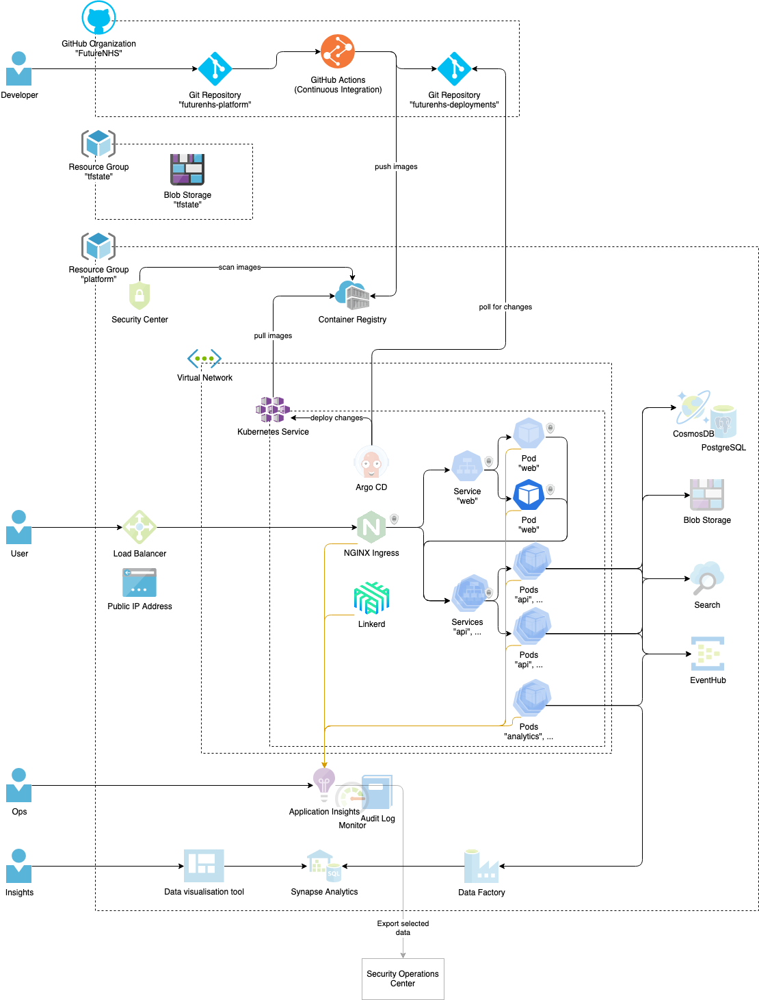

# Architecture

## High level diagram

- Transparent items don't exist, yet. They represent our current plan and might change when we implement them.
- Connections in the cluster marked with a shield and padlock symbol use multual TLS (provided by Linkerd).
